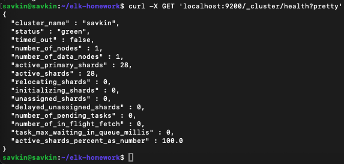
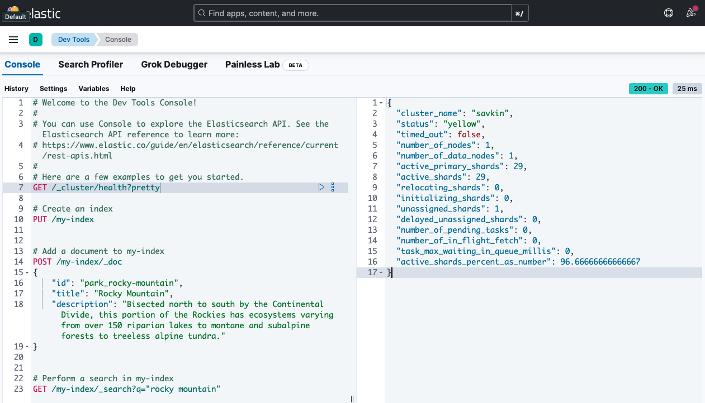
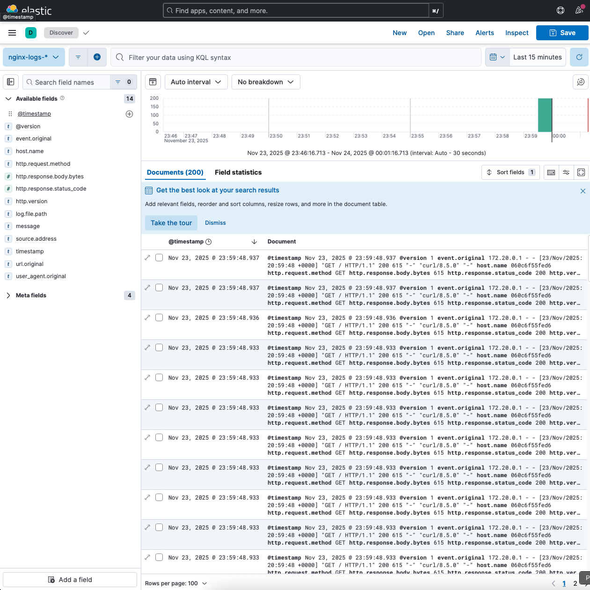
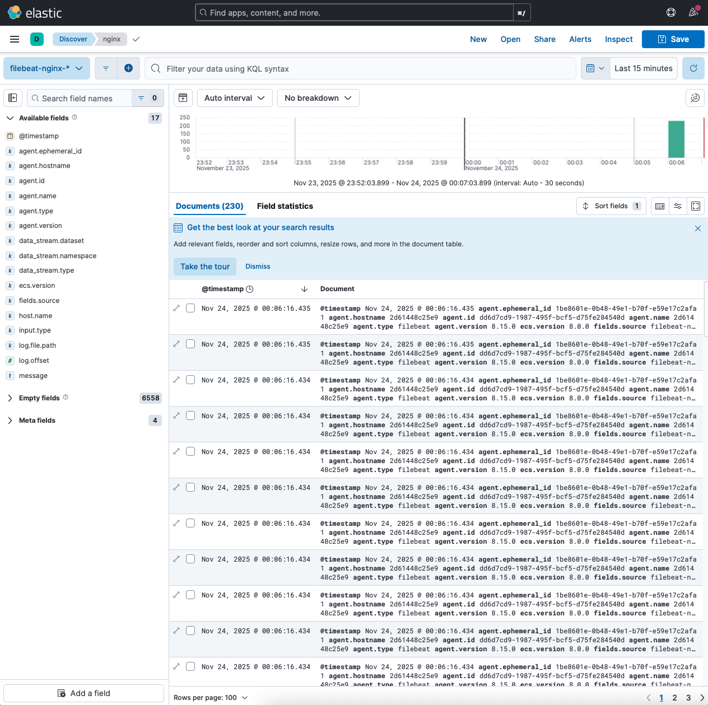

# Домашнее задание к занятию «ELK»

## Задание 1. Elasticsearch

## Задание 2. Kibana (Dev Tools)

## Задание 3. Logstash → логи Nginx в Elasticsearch

## Задание 4. Filebeat → логи Nginx в Elasticsearch

Всё поднято через docker-compose на Ubuntu 24.04  
cluster_name `savkin`  
Логи Nginx успешно отправлены через Logstash и через Filebeat в разные индексы  
В Kibana созданы соответствующие index patterns и видны логи из обоих источников
