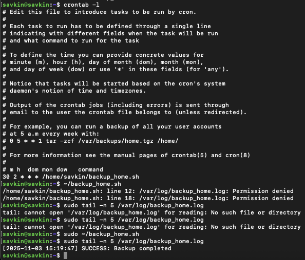

# Домашнее задание: Резервное копирование

## Задание 1: Зеркальная копия домашней директории через `rsync`

**Цель:** Создать полную зеркальную копию домашней директории пользователя в `/tmp/backup` с помощью `rsync`.

### Требования:
- Исключить все скрытые файлы и папки (начинающиеся с `.`)
- Исключить директорию `postgres_data` (доступ запрещён)
- Проверять хэш-суммы всех файлов (`--checksum`)
- Удалять лишние файлы в приёмнике (`--delete`)
- Сохранять права, владельца, время, жёсткие ссылки

### Команда:
```bash
rsync -aH --delete --checksum \
      --exclude='.*' \
      --exclude='postgres_data' \
      ~ /tmp/backup
```


## Задание 2: Ежедневное резервное копирование через `cron`

**Цель:** Настроить ежедневное автоматическое зеркальное копирование домашней директории с логированием.

### 1. Скрипт: 
[Скрипт бэкапа](configs/backup_home.sh)


