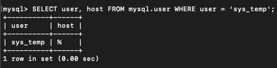
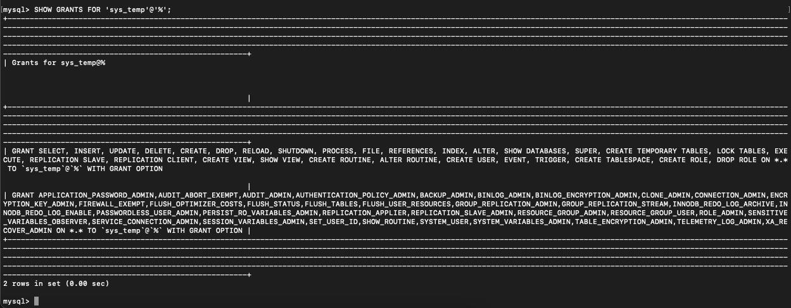
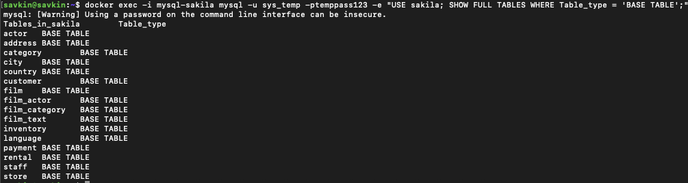

# Домашнее задание к занятию «Работа с данными (DDL/DML)

## Задание 1. Поднятие MySQL и восстановление базы Sakila

### 1. Запуск MySQL 8.0 в Docker
```bash
docker run --name mysql-sakila \
  -e MYSQL_ROOT_PASSWORD=rootpassword \
  -e MYSQL_DATABASE=sakila \
  -p 3306:3306 \
  -d mysql:8.0 \
  --default-authentication-plugin=mysql_native_password
```
#### Создание пользователя и выдача прав
```sql
CREATE USER 'sys_temp'@'%' IDENTIFIED WITH mysql_native_password BY 'temppass123';
GRANT ALL PRIVILEGES ON *.* TO 'sys_temp'@'%' WITH GRANT OPTION;
FLUSH PRIVILEGES;
```







## Задание 2. Первичные ключи таблиц базы sakila

| Название таблицы   | Первичный ключ                    |
|--------------------|-----------------------------------|
| actor              | `actor_id`                        |
| address            | `address_id`                      |
| category           | `category_id`                     |
| city               | `city_id`                         |
| country            | `country_id`                      |
| customer           | `customer_id`                     |
| film               | `film_id`                         |
| film_actor         | `actor_id`, `film_id`             |
| film_category      | `film_id`, `category_id`          |
| film_text          | `film_id`                         |
| inventory          | `inventory_id`                    |
| language           | `language_id`                     |
| payment            | `payment_id`                      |
| rental             | `rental_id`                       |
| staff              | `staff_id`                        |
| store              | `store_id`                        |
