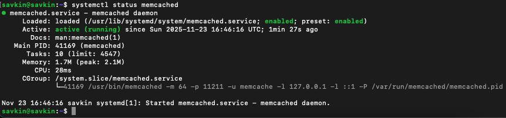
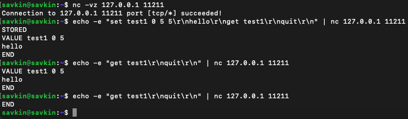
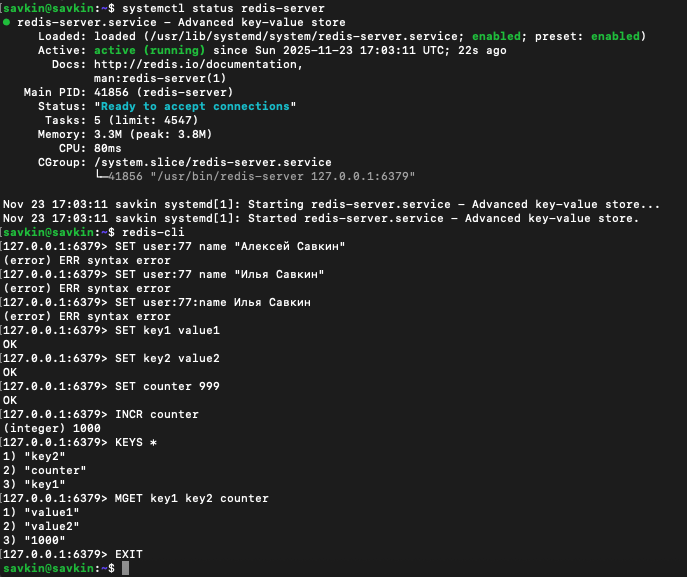

# Домашнее задание к занятию «Кэширование Redis/memcached»

## Задание 1. Какие проблемы решает кэширование

Кэширование решает следующие основные проблемы (по материалам лекции):

- Тяжёлые и частые запросы к основной базе данных
- Высокая нагрузка на «горячие» данные (профили, сессии, товары)
- Пиковые всплески трафика («собачья свадьба», чёрная пятница)
- Экономия ресурсов основной СУБД
- Ускорение внешних API
- Rate limiting, защита от брутфорса
- Хранение сессий и временных данных

## Задание 2. Memcached запущен

## Задание 3. Удаление по TTL в Memcached (5 секунд)

До истечения TTL — ключ есть  
Через 10 секунд — ключ удалён

## Задание 4. Запись и чтение в Redis

